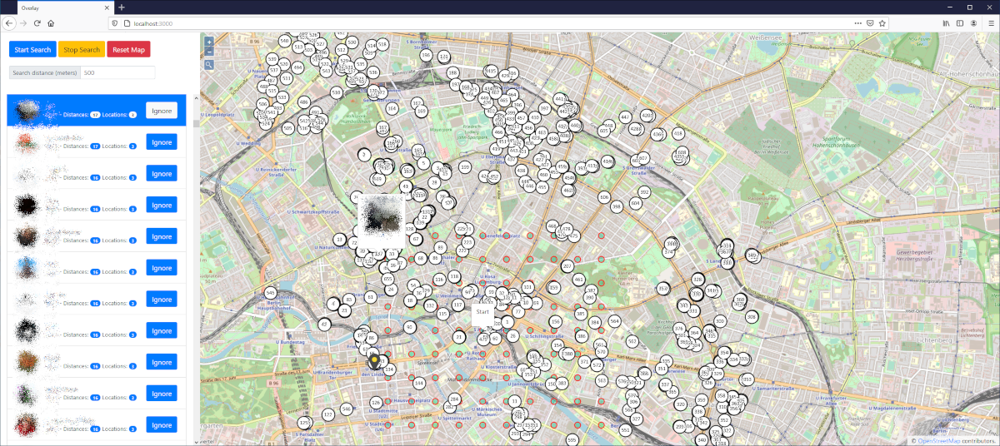

# Telegram Nearby Map

Telegram Nearby Map uses OpenStreetMap and the official Telegram library to find the position of nearby users.

**Please note:** Telegram's API was updated a while ago to make nearby user distances less precise, preventing exact location calculations. Therefore, Telegram Nearby Map displays users nearby, but does not show their exact location.

Inspired by [Ahmed's blog post](https://blog.ahmed.nyc/2021/01/if-you-use-this-feature-on-telegram.html) and a [Hacker News discussion](https://news.ycombinator.com/item?id=25641399).
Developed by [github.com/tejado](https://github.com/tejado).

  

## How does it work?
Every 25 seconds all nearby users will be received with [TDLib](https://core.telegram.org/tdlib) from Telegram. This includes the distance of every nearby user to "my" location. With three distances from three different points, it is possible to calculate the position of the nearby user.

This only finds Telegram users which have activated the nearby feature. Per default it is deactivated.

## Installation

Requirements: node.js and an Telegram account

1. Create an API key for your Telegram account [here](https://my.telegram.org)
2. Download the repository
3. Create config.js (see config.example.js) and put your Telegram API credentials in it
4. Install all dependencies: npm install
5. Start the app: npm start
6. Look carefully at the output: you will need to confirm your Telegram login
7. Go to http://localhost:3000 and have fun

## Changelog

### 2023-09-23
- Switched to [prebuild-tdlib](https://github.com/Bannerets/tdl)
- Updated all dependencies
- Bugfix of the search distance field

### 2021-11-13
- Added [tdlib.native](https://github.com/ForNeVeR/tdlib.native/releases) for Linux (now it works in GitHub Codespaces)
- Updated all dependencies
- Bugfixes
